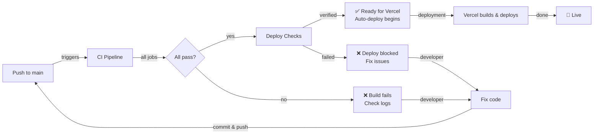

# Workflow Checks & Automated Validation

## Overview

This project has comprehensive automated checks that run on **every push** and **pull request** to ensure code quality, security, and deployability.

## Workflow Structure

### 1. **CI Pipeline** (`.github/workflows/ci.yml`)
Triggered on: `push` to `main` and all `pull_request`s

**Jobs:**
- ✅ **Lint & Typecheck** - ESLint + TypeScript validation
- ✅ **Unit Tests** - Vitest suite
- ✅ **Integration Tests** - Database + service layer tests
- ✅ **E2E Tests** - Playwright browser automation
- 🔒 **Security Scan** - npm audit + gitleaks
- 📦 **Build** - Next.js production build (depends on lint-typecheck)
- 📋 **Truth File Drift Check** - Validates docs/TRUTH.md

### 2. **Deploy Checks** (`.github/workflows/deploy-checks.yml`)
Triggered on: `push` to `main` and after `CI` workflow

**Jobs:**
- ✅ **Check CI Status** - Ensures CI passed
- ✅ **Deploy Readiness** - Environment validation
  - Prisma schema verification
  - Bundle size check
  - Required secrets check
- 📊 **Notify Deployment** - Status reporting

## Automated Flow



## Check Details

### Lint & Typecheck
```bash
pnpm lint      # ESLint validation
pnpm typecheck # TypeScript strict mode
```
- Runs in parallel with other checks
- Blocks build if errors found
- Auto-fixable issues can be fixed with `pnpm lint:fix`

### Tests
```bash
pnpm test:unit        # Fast unit tests
pnpm test:integration # Database tests
pnpm test:e2e         # Full app tests
```
- Unit tests run immediately
- Integration tests spin up PostgreSQL
- E2E tests build app and run in Playwright
- All playwright reports saved as artifacts

### Security Scan
```bash
pnpm audit --audit-level=high  # NPM vulnerability check
gitleaks                        # Secret detection
```
- Scans for exposed secrets/credentials
- Audits dependencies for vulnerabilities
- Non-blocking (doesn't prevent deployment)

### Build Verification
```bash
pnpm build  # Full production build
```
- Requires lint-typecheck to pass first
- Generates optimized Next.js bundle
- Tests bundling works correctly

### Deploy Readiness
- Validates Prisma schema: `pnpm prisma validate`
- Checks required environment variables exist
- Verifies production build succeeds
- Generates deployment summary

## Viewing Results

### GitHub Actions Dashboard
1. Go to: https://github.com/wizelements/family-powerhouse/actions
2. View all workflow runs
3. Click any run to see detailed logs
4. Check individual job status

### Commit Status Badges
In GitHub PRs and commits:
- 🟢 **Green** = All checks passed
- 🟡 **Yellow** = Checks running
- 🔴 **Red** = Checks failed

### Artifacts
After workflow completion:
- Playwright report (E2E tests)
- Deployment summary
- Build logs

## Local Pre-commit

Before pushing, run locally:
```bash
pnpm lint      # Check code style
pnpm typecheck # Check types
pnpm test:unit # Run fast tests
pnpm build     # Full build test
```

## Deployment Policy

### Automatic Deployment
- ✅ **Enabled** when:
  - All CI checks pass
  - Deploy readiness verified
  - Push to `main` branch

### Manual Overrides
To prevent deployment:
1. Force-push with empty commit before checks complete
2. (Not recommended - blocks main development)

### Vercel Integration
- Vercel automatically receives deployment signal from GitHub
- Deployment happens on successful CI + deploy-checks
- Check Vercel dashboard: https://vercel.com/wizelements/family-powerhouse

## Troubleshooting

### "Build failed"
1. Check build error in GitHub Actions
2. Run `pnpm build` locally
3. Fix and push again

### "Lint errors"
```bash
pnpm lint:fix  # Auto-fix issues
git add .
git commit -m "fix: lint errors"
git push
```

### "Type errors"
1. Run `pnpm typecheck` locally
2. Fix TypeScript issues
3. Push commit

### "Tests failing"
1. Check which test suite failed
2. Run locally: `pnpm test:unit`, `pnpm test:integration`, `pnpm test:e2e`
3. Debug and fix
4. Push commit

### "Security scan failed"
For npm audit:
```bash
pnpm audit fix  # Auto-fix vulnerabilities
```

For gitleaks (secrets):
1. Remove secret from code
2. Run: `git log --all --full-history -- <file>` to find in history
3. Use: `git filter-branch` to remove from history (if critical)
4. Force push (if in history)

## Custom Checks

To add new checks:
1. Create `.github/workflows/my-check.yml`
2. Use same trigger: `on: [push, pull_request]` to `main`
3. Add job that exits non-zero on failure
4. Update this document

## Environment Variables for Workflows

Required secrets in GitHub (Settings > Secrets & variables):
- `NEXTAUTH_SECRET` - NextAuth.js secret
- Database URL (if needed for testing)
- Any 3rd party API keys

These are available as: `${{ secrets.SECRET_NAME }}`

## Status Badges

Add to README.md:
```markdown
[](https://github.com/wizelements/family-powerhouse/actions/workflows/ci.yml)
[](https://github.com/wizelements/family-powerhouse/actions/workflows/deploy-checks.yml)
```

## Monitoring

### Real-time Notifications (Optional)
Set up GitHub Actions notifications:
1. Go to GitHub notifications settings
2. Enable "Participating" for this repo
3. Receive alerts on workflow failures

### Slack Integration (Optional)
Add workflow notification to Slack:
```yaml
- name: Notify Slack
  if: failure()
  uses: slackapi/slack-github-action@v1
  with:
    webhook-url: ${{ secrets.SLACK_WEBHOOK }}
```

## Performance Tips

To keep CI fast:
- Keep unit tests fast (< 5s)
- Run E2E tests in parallel where possible
- Cache dependencies: pnpm cache is automatic
- Don't re-run heavy builds if not needed

---

**Last Updated**: When deploy-checks.yml was added
**Workflow Status**: https://github.com/wizelements/family-powerhouse/actions
